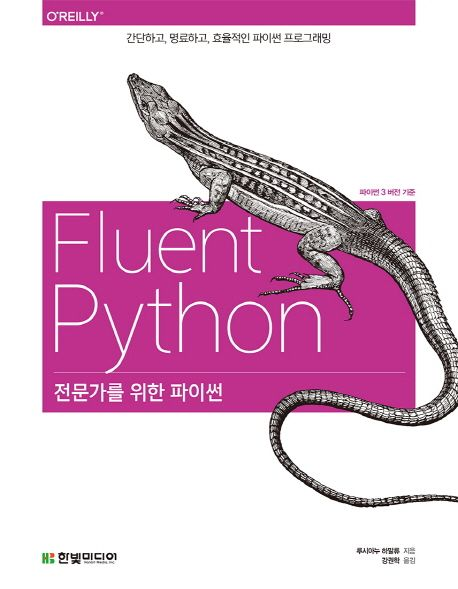

    
    <h1> [ Fluent Python ] </h1>

---  

##### Chapter 01. 파이썬 데이터모델
- Chapter 01 / Python Data Model.ipynb
##### Chapter 02. 시퀀스
##### Chapter 03. 딕셔너리와 집합
##### Chapter 04. 텍스트와 바이트
##### Chapter 05. 일급 함수
##### Chapter 06. 일급 함수 디자인 패턴
##### Chapter 07. 함수 데커레이터와 클로저
##### Chapter 08. 객체 참조, 가변성, 재활용
##### Chapter 09. 파이썬스러운 객체
##### Chapter 10. 시퀀스 해킹, 해시, 슬라이스
##### Chapter 11. 인터페이스 : 프로토콜에서 ABC까지
##### Chapter 12. 내장 자료형 상속과 다중 상속
##### Chapter 13. 연산자 오버로딩 : 제대로 하기
##### Chapter 14. 반복형, 반복자, 제너레이터
##### Chapter 15. 콘텍스트 관리자와 else블록
##### Chapter 16. 코루틴
##### Chapter 17. Future를 이용한 동시성
##### Chapter 18. asyncio를 이용한 동시성
##### Chapter 19. 동적 속성과 프로퍼티
##### Chapter 20. 속성 디스크립터
##### Chapter 21. 클래스 메타프로그래밍

